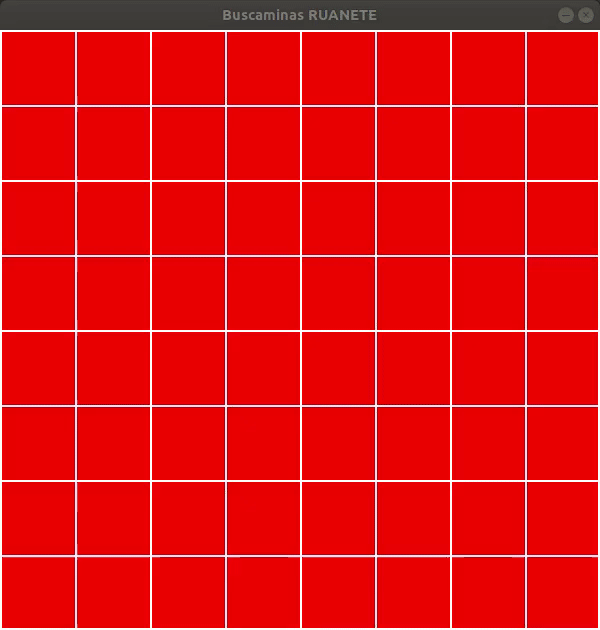

# BuscaminasPY
Me he dispuesto a realizar el famoso juego del Buscaminas en un lenguaje que no había utilizado nunca, es el caso de Python, me ha parecido muy sencillo de aprender. Además, he usado la biblioteca para la realización de juegos arcade como es PyGame, la cual me ha facilitado mucho el realizar la interfaz gráfica del juego. Es una versión muy simple, pero funcional, la cual me ha servido para aprender un poco del lenguaje Python. 

Para la instalación de los requisitos tan solo deben ejecutar:
`pip3 install -r requirements.txt`

Para la ejecución del juego simplemente hay que realizar:
`python3 buscaminas.py`

Os dejo un ejemplo de como es el funcionamiento del juego:

